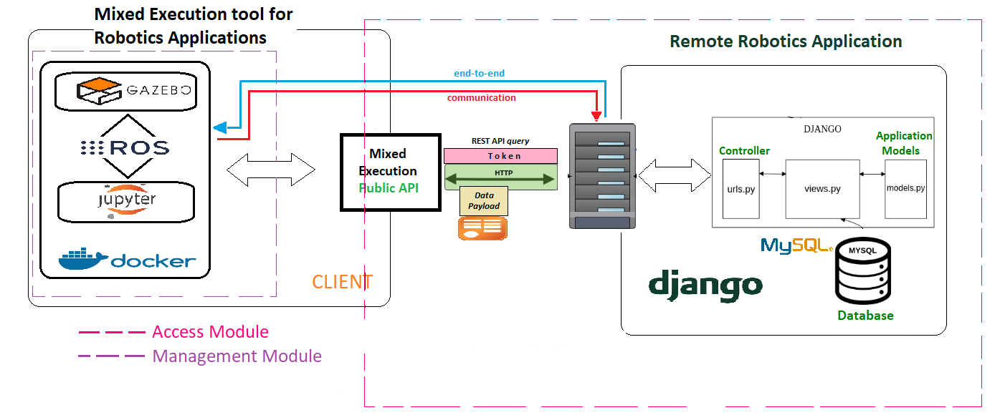

# TFM-Webserver


* [1. Descripción del Proyecto.](#1-descripcion)
    + [1.1. Visisón General.](#1.1-vision-general)
    + [1.2. Estructura de Módulos de la Aplicación.](#1.2-estructura-aplicacion)
* [2. Ejecución de la Aplicación.](#2-ejecucion_aplicacion)
    + [2.1. Ejecución del lado Servidor Web.](#2.1-ejecucion-servidor-web)
    + [2.2. Ejecución del lado Servidor de Ejecución Mixta.](#2.2.ejecucion-servidor-mixta)
* [3. Uso de la Ejecución Mixta.](#3-uso)
* [4. Instalación.](#4-instalacion)
    + [4.1. Instalación para Cliente](#4.1-instalacion-cliente)
    + [4.2. Instalación para Desarrollador](#4.2-instalacion-desarrollador)
        - [4.2.1. Instalación de docker para desarrollo.](#4.2.1-instalacion-docker-desarrollo)
        - [4.2.2. Instalación de Base de Datos (MySQL).](#4.2.2-instalacion-mysql)
        - [4.2.3. Instalación de Django y Dependencias.](#4.2.3-instalacion-django-dependencias)

## 0. Diagrama General de la Aplicación



---

<a name="1-descripcion"></a>

## 1. Descripción del Proyecto.

Este repositorio se ha creado para alojar el código relacionado con la implementación de la idea propuesta como Tésis de Fin de Máster bajo el título "Ejecución Mixta de Ejercicios de Visión Artificial y Robótica a través de la Web" porpuesto por Carlos Awadallah Estévez como colofón al Máster en Robótica y Automatización de la Universidad Carlos III de Madrid, España.

<a name="1.1-vision-general"></a>
### 1.1. Visisón General.

Para este trabajo se ha creado un servidor que ofrece a través de la web una aplicación robótica orientada, en principio, a la docencia, enseñanza e investigación en robótica. El servicio que se ofrece es de escasa relevancia, pues sólo se ha implementado con el fin de demostrar el funcionamiento de la herramienta de Ejecución Mixta, objeto de este trabajo. Así, se ha montado una infraestructura básica que da un servicio de ejercicios robóticos, tanto simulados como reales, a usuarios que utilizan la Ejecución Mixta.

Esta herramienta será la encargada de comunicar el servicio robótico remoto con el _hardware_ local del cliente, con lo que se consigue que todo el consumo de recursos asoaciado a la ejecución y cómputo que genera la interacción con un usuario recaiga sobre él, liberando al servidor web de toda carga y abriendo la puerta a la construcción de aplicación con capacidad de personalización y multitud de opciones para el usuario, que dispone de un _hardware_ robótico específico, o ninguno.

<a name="1.2-estructura-aplicacion"></a>
### 1.2. Estructura de Módulos de la Aplicación.

El código de este proyecto está dividido en dos partes principales, bien diferenciadas:

1. Aquello bajo la ruta `tfm_webserver` se corresponde con el código de la aplicación web que ofrece y sirve ejercicios de robótica y visión artificial. Esta basada en tecnología Django para el backend de operaciones de servicio web.

2. El directorio `docker_files` contiene la mayor parte del código de la imagen de "Ejecución Mixta". El _middleware_ o secuenciador que se encarga de gestionar la comunicación entre ambas partes se encuentra entre el código JS de la aplicación web. Este directorio contiene todo aquello que la herramienta de Ejecución Mixta será capaz de ejecutar y gestionar para el usuario.

---

<a name="2-ejecucion_aplicacion"></a>
## 2. Ejecución de la Aplicación.

<a name="2.1-ejecucion-servidor-web"></a>
### 2.1. Ejecución del lado Servidor Web.

```bash
python manage.py runserver 0.0.0.0:8000
```

**NOTA**: se puede indicar cualquier otro _endpoint_ (IP:puerto) deseado. En este caso, la especificación 0.0.0.0 indica que se quiere escuchar en todas las direcciones de la máquina.

<a name="2.2.ejecucion-servidor-mixta"></a>
### 2.2. Ejecución del lado Servidor de Ejecución Mixta.

```bash
mkdir -p /tmp/siguelineaIR/ && docker run --rm -e DISPLAY=:0 -e JDEROBOT_SIMULATION_TYPE=REMOTE --entrypoint /entrypoint_mixed_execution.sh -v /tmp/siguelineaIR:/home/jderobot/volume/user/exercise:rw -p 8888:8888 -p 8080:8080 -p 9001:9001 -p 9002:9002 -it tfmdocker/local:dev2 [OPTIONAL WORLD] [OPTIONAL AUX1] [OPTIONAL AUX2] ...
```

- Como se puede observar, hay un establecimiento inicial de un entorno completamente aislado para el lanzamiento de la Ejecución Mixta sobre él, con la creación de un directorio temporal sobre el que se montará el volumen docker: `mkdir -p /tmp/siguelineaIR/` y `-v /tmp/siguelineaIR:/home/jderobot/volume/user/exercise:rw`.

- Por otro lado, se indica la configuración del secuenciador en el _entrypoint_. Esto es `--entrypoint /entrypoint_mixed_execution.sh`

- Se indicará también la secuencia de puertos de escucha de la Ejecución Mixta, según distintas herramientas saquen o soliciten información por ellos: `-p 8888:8888 -p 8080:8080 -p 9001:9001 -p 9002:9002`

- Se podrá indicar una serie de argumentos opcionales, como un fichero de simulación [WORLD] u otras aplicaciones auxiliares como _Proxys_ o _Drivers_.

---

<a name="3-uso"></a>
## 3. Uso de la Ejecución Mixta.

Como Cliente Web se realiza la función de servidor de Ejecución Mixta. Para utilizar esta herramienta, sólo es necesario acceder a la web de la aplicación que utiliza esta tecnología y solicitar una conexión para iniciar una Ejecución Mixta de tareas robóticas. La aplicación accderá al API de Ejecución Mixta, resolviendo todo lo necesario para el buen funcionamiento, y le indicará al usuario web qué herramientas necesita lanzar en modo Mixto. Así, el servidor de Ejecución Mixta se lanzará, según sean estos requisitos, con un comando similar al que se mostró en [2.2](#2.2.ejecucion-servidor-mixta).

El uso es por tanto muy simple y no requiere la instalación de ningún módulo o paquete adicional a Docker.

---

<a name="4-instalacion"></a>
## 4. Instalación.

<a name="4.1-instalacion-cliente"></a>
### 4.1. Instalación para Cliente

El cliente Web sólo debe instalar Docker para funcionar, dado que todo lo demás le es transparente. Para ello, ejecutar la siguiente instrucción:

```bash
pip install docker
```

<a name="4.2-instalacion-desarrollador"></a>
### 4.2. Instalación para Desarrollador

Para desarrollar en este proyecto se hace necesario replicar el aldo servidor web. Para ello, existen algunas dependencias que satisfacer y herramientas que configurar que permitan ofrecer el servicio. A continuación se recoge dicha configuración.

<a name="4.2.1-instalacion-docker-desarrollo"></a>
#### 4.2.1. Instalación de docker para desarrollo.

Procedimiento de instalación extraído de la documentación oficial. Febrero de 2019.

```bash
sudo apt update
sudo apt install -y apt-transport-https ca-certificates curl software-properties-common
curl -fsSL https://download.docker.com/linux/ubuntu/gpg | sudo apt-key add -
sudo add-apt-repository "deb [arch=amd64] https://download.docker.com/linux/ubuntu bionic stable"
sudo apt update
sudo apt install -y docker-ce
```

<a name="4.2.2-instalacion-mysql"></a>
#### 4.2.2. Instalación de Base de Datos (MySQL).

Para la instalación del backend de Base de Datos utilizado en esta aplicación es necesario hacer lo siguiente:

```bash
sudo apt install mysql-server
sudo apt-get install -y python-mysqldb
```

Después, depenediendo de la distribución del OS del servidor (Ubuntu 16.04 ó 18.04), hacer:
---
- Ubuntu 16.04
---
Meter la contraseña _root_

---
-Ubuntu 18.04
---
configuración inicial

```bash
sudo mysqld_safe --skip-grant-tables&
sudo mysql --user=root mysql
mysql> update user set authentication_string=PASSWORD('new-password') where user='root';
mysql> flush privileges;
mysql> quit
sudo service mysql restart
sudo mysql -u root -p
```

Después, lanzar el configurador

```bash
sudo mysql_secure_installation
```

Luego hay que entrar a la consola de MySQL y crear la base de datos:

```bash
mysql> CREATE DATABASE <database>;
```

Se recomienda eliminar las restricciones en lo relativo a la contraseña de acceso antes de continuar:

```bash
SET GLOBAL validate_password_mixed_case_count = 0;
SET GLOBAL validate_password_number_count = 0;
SET GLOBAL validate_password_special_char_count = 0;
```
---

Una vez finalizada la instalación, hay que crear el usuario para acceder a la Base de Datos y administrarla. Para ello, hacer lo siguiente:

Se crea el usuario con

```bash
mysql> CREATE USER '<user>'@'localhost' IDENTIFIED BY '<pass>';
```

Luego se garantiza los privilegios de acceso al nuevo usuario, y se refrescan los privilegios:

```bash
GRANT ALL PRIVILEGES ON *.* TO '<user>'@'localhost';
FLUSH PRIVILEGES;
```

**NOTA**: Con el usuario y la base de datos creados, puede resultar interesante rellenar las tablas de la nueva Base de Datos con una copia funcional del estado actual de la aplicación. Para ello, contactar con el administrador (carlosawadallah@gmail.com). Una vez se disponga de la copia, ejecutar lo siguiente: `mysql -u <user> -p <database> < copia.sql`

<a name="4.2.3-instalacion-django-dependencias"></a>
#### 4.2.3. Instalación de Django y Dependencias.

La lista de paquetes (pip), herramientas y dependencias de la aplicación web es la siguiente:

| Módulo       | Versión        | Instalación                   | Observaciones                                                |
| ------------ | -------------- | ----------------------------- | ------------------------------------------------------------ |
| Django       | `1.9` ó `1.11` | `pip install django==1.11`    | Versiones válidas entre la 1.9 y 1.11.                       |
| JSON         | `3.16.0`       | `pip install simplejson`      | Gestión de Peticiones con contenido JSON.                    |
| Channels     | `1.1.5`        | `pip install channels==1.1.5` | Conexiones WebSockets (incluye `daphne==1.4.2` y `asgi-redis==1.2.0`). |
| PyGitHub     | `1.43.2`       | `pip install pygithub`        | Gestión de los ficheros de código de usuario con GitHub.     |
| Django Extensions |     *     | `pip install django-extensions` |  Extensiones de Django                                     |
| MySQL Client | `1.3.14`       | `pip install mysqlclient==1.3.14` | Cliente de MySQL para la Base de Datos                   |
| Redis Server |     *          | `apt install redis-server`    | Backend de gestión de WebSockets.                            |


